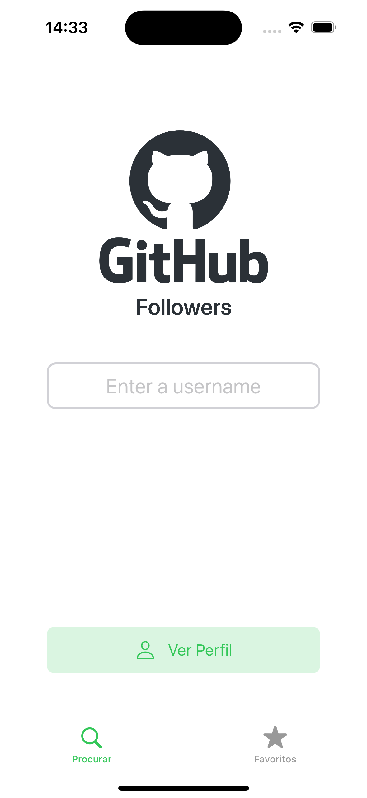
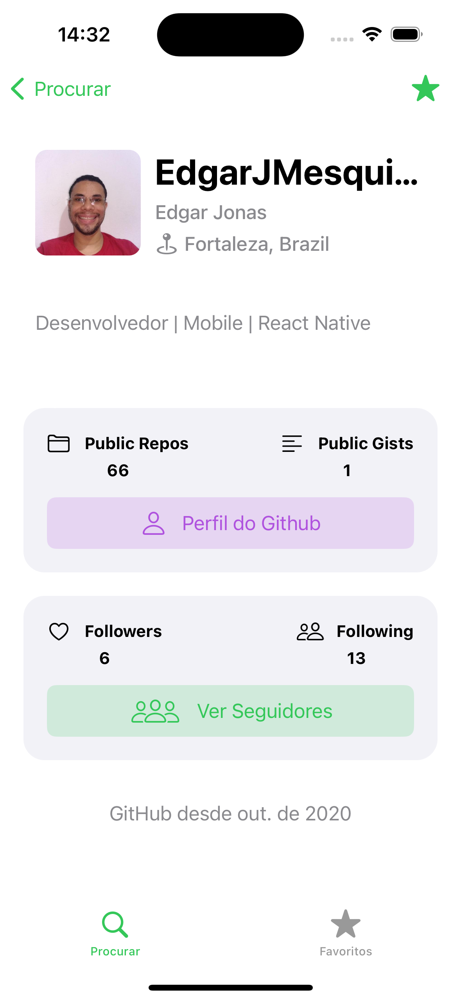
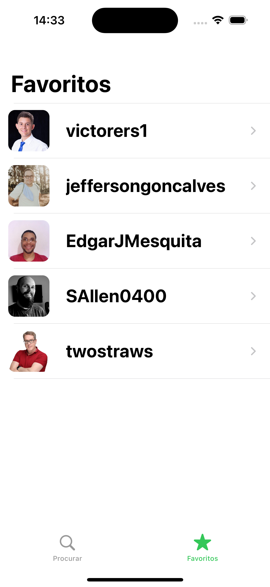
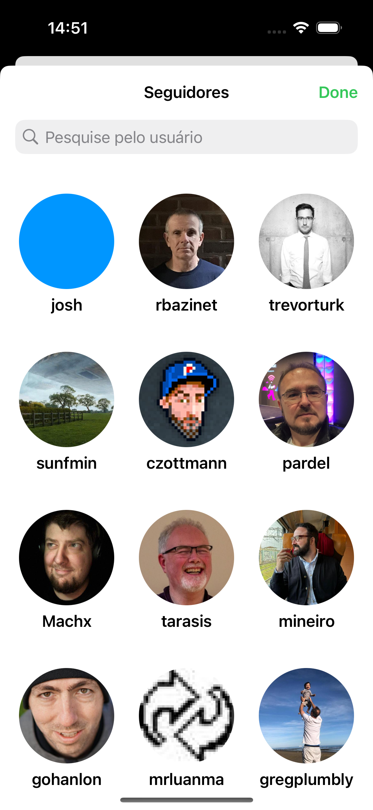

# GitHub Followers

## Topics

- Swift
- UIKit Programmatically(View Code)
- UICollectionViewDiffableDataSource(Cool Animations)
- SwiftUI inside UIKit Programmatically
- MVVM
- Async/Await
- UITableView
- UserDefaults
- Locale pt_BR

## Preview

    

        Search
        
    

    

        User Info
        
    

#

   

        Favorites
        
    

    

        Followers
        
    

#

_Special thanks to @SAllen0400 for all the amazing content._
